# Team Alef (ℵ)
Application name: <a href="https://cs326project.herokuapp.com/">KanvasWire</a>

Semester: Fall 2022

# Overview
KanvasWire is a platform that enable users to post their project ideas to collaborate with like-minded individuals. KanvasWire offers a variety of services for collaboration such as: a comment section for discussion, an interactive canvas to illustrate their ideas, and a chat to communicate with collaborators. The novelty of our platform comes in the form of combining those services together into one innovative product. Our platform's target audience are people with a STEM and tech background and we made sure to address their needs through our website. For instance, we implemented a chat feature to enable users to send equations using LaTeX as we believe this would improve communication and enhance productivity. You can try out KanvasWire [here](https://cs326project.herokuapp.com/) or through the url: [https://cs326project.herokuapp.com/](https://cs326project.herokuapp.com/). 

# Team Members
- Hieu Nguyen ([HieuHongHao](https://github.com/HieuHongHao))
- Peter Phan ([PPhan-sil](https://github.com/PPhan-sil/))
- Phat Nguyen ([PeterNg15](https://github.com/PeterNg15))

# User Interface
- Toggle light/dark mode

## Landing page
- View new projects, project leaderboard
- Default landing page


## Login
- Login and be redirected to account page
- Authorization (more info [here](#authorization))

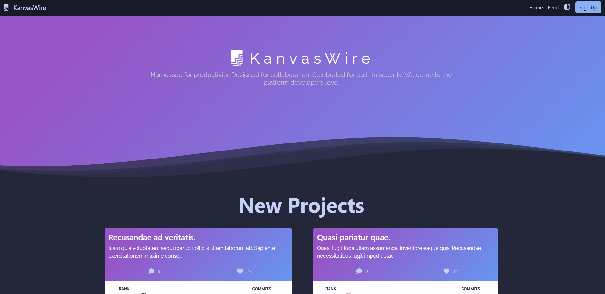

## Registration 
- Create new account
- Passwords are encrypted in DB using SHA-256 (more info [here](#authentication))

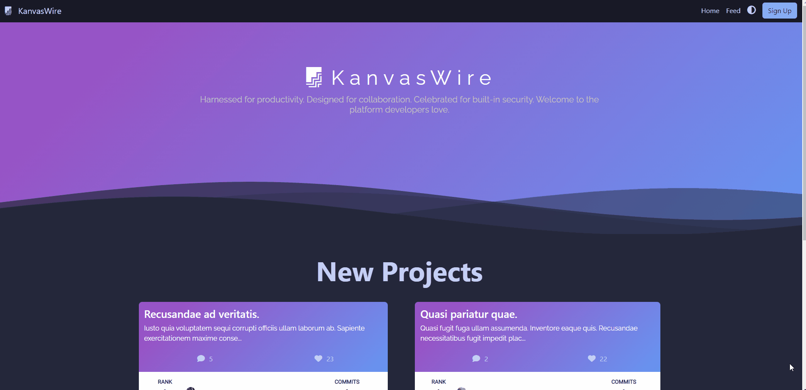

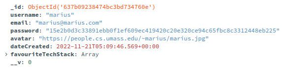

## Account
- Display account info (profile picture, username)
- Display personal statistics
- Manage projects (view project, see number of likes, navigate to project, delete project)
- Manage account (change passwords, delete account)

<center><h2>Manage projects</h2></center>
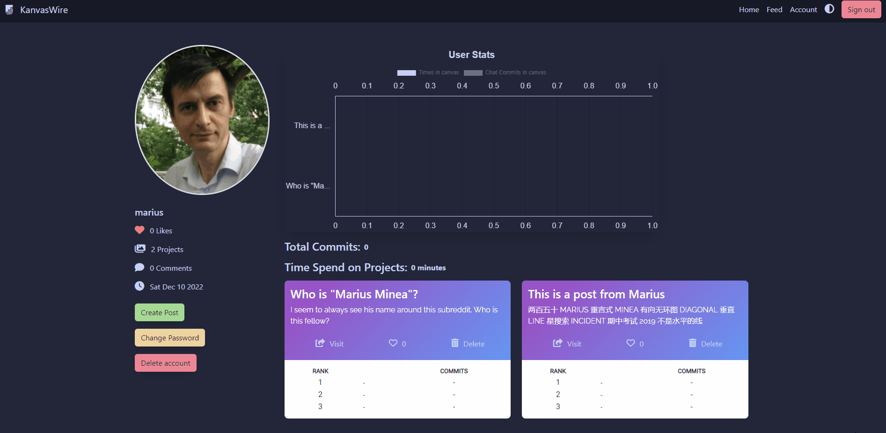

<center><h2>Change password</h2></center>


<center><h2>Delete account</h2></center>
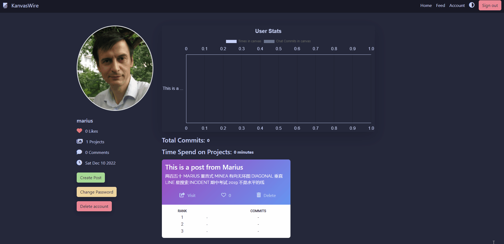

## Feed
- Toggle between "new", "top", and "github projects"
- Like and unlike a post
- View post contents
- Redirection to post-specific pages (project page, Kanvas page)
- Add new posts
- Infinite scrolling
- Search posts by tags or title (i.e. '`tags: [...]`' and '`title: [...]`')
- Search posts from Github by tags or title

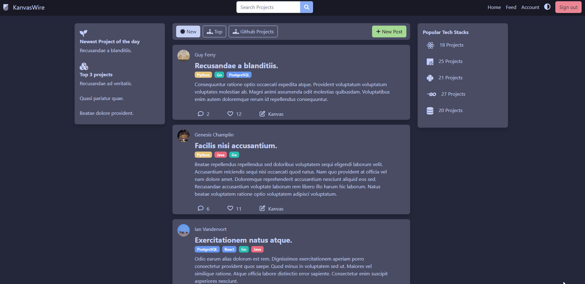

<center><h2>Search</h2></center>
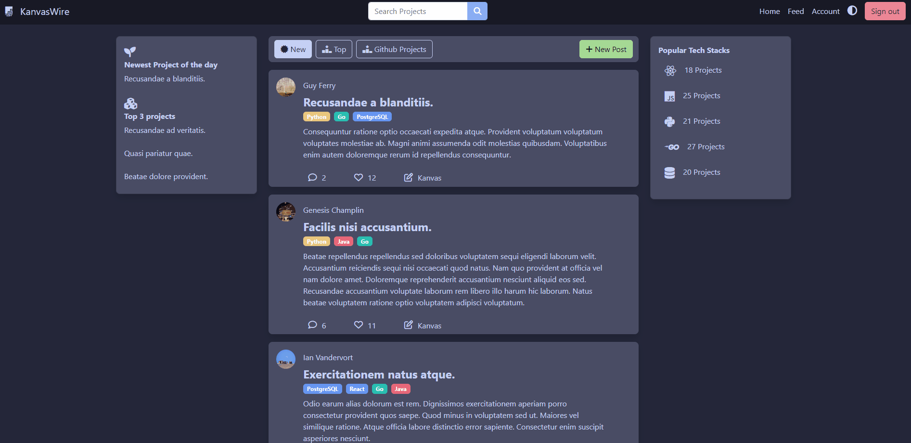

<center><h2>Search in Github</h2></center>
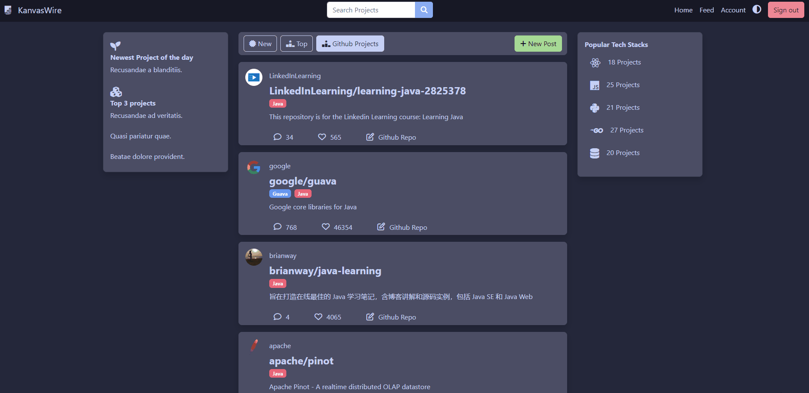

<center><h2>Create Post</h2></center>
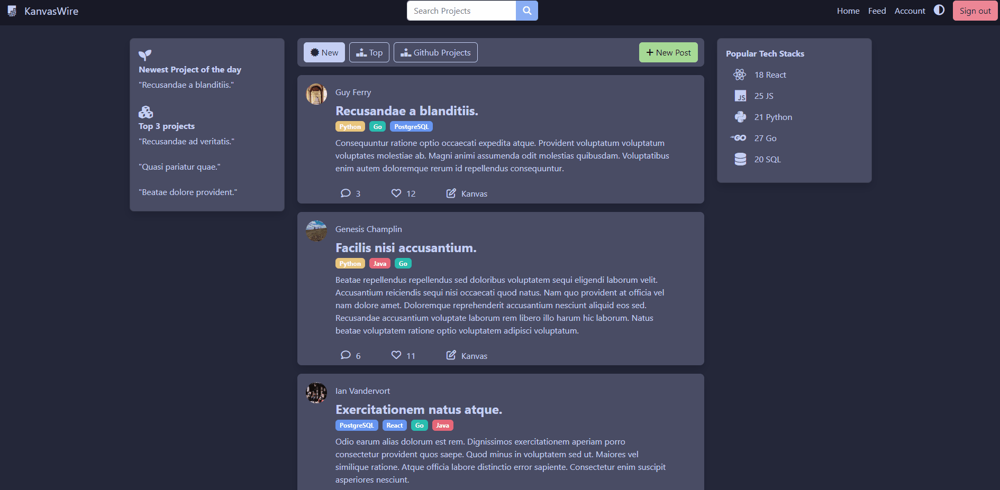

## Project page
- Unique URL
- Add comment
- See number of likes
- View post content
- Redirection to Canvas page

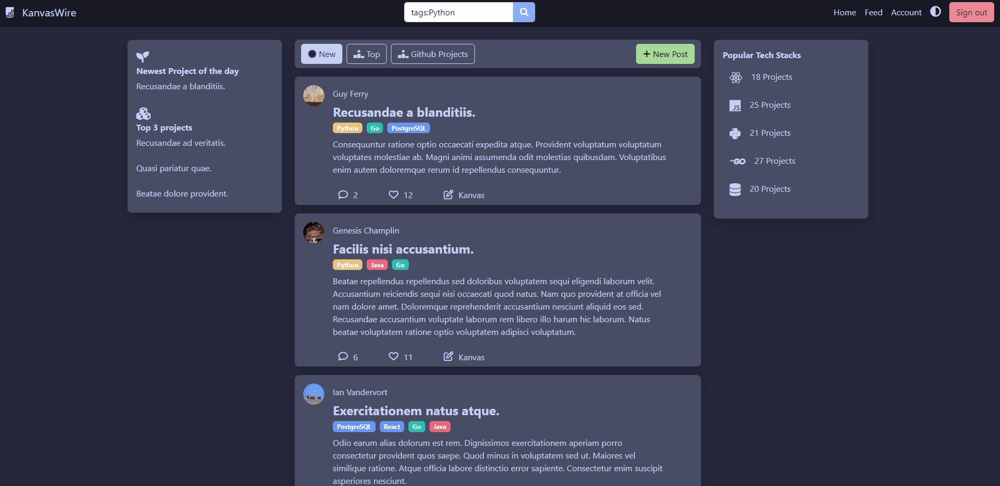

## Canvas
- Unique URL
- Draw on canvas (real-time, change paint brush, toggle eraser, change brush color, change brush size)
- Drawing is interactive through websockets
- Chat (send messages and math equations in real-time, toggle chat visibility)
- Each project has its own canvas page and chat
- Notification when someone joins canvas page with avatar of active users in the bottom left of page
- Update chat commit and uptime AFTER disconnecting/refreshing canvas page (for statistics)


<center><h2>Chat</h2></center>


## Custom 404 Page


# APIs

## Users
| Path          | Method      | Input | Example     | Description |
| ------------- | ----------- | ----------- | ----------- | ----------- |
| `/users/:id`        | GET  | N/A                               | [here](https://cs326project.herokuapp.com/api/users/6393d0f23e1af091efe8e7a3) | Get user by id   
| `/users`            | POST | username, email, password, avatar | Use UI   | Create user 
| `/users/delete/:id` | POST | id                                | Use UI   | Delete user and their projects, comments, likes
| `/users/:id`        | PUT  | id, req.body                      | Use UI   | Update user information


## Projects / Posts
| Path          | Method      | Input | Example     | Description |
| ------------- | ----------- | ----------- | ----------- | ----------- |
| `/projects` | GET | N/A | [here](https://cs326project.herokuapp.com/api/projects) | Get all projects
| `/projects/:id` | GET | id | [here](https://cs326project.herokuapp.com/api/projects/6393d0f23e1af091efe8e7de) | Get project by ID
| `/projects/author/:id` | GET | authorID | [here](https://cs326project.herokuapp.com/api/projects/author/6393d0f23e1af091efe8e7a3) | Get project by author ID
| `/projects` | POST | authorID, title, content, tags | Use UI | Create a new project
| `/projects/delete/:id` | POST | id | Use UI | Delete project and its comments, likes
| `/projects/:id` | PUT | id, req.body | N/A | Update a project
| `/api/projects/:id/like` | POST | id, userID | Use UI | Create or delete a like for a project
| `/projects/:id/topContributors` | GET | id | [here](https://cs326project.herokuapp.com/api/projects/6393d0f23e1af091efe8e7c3/topContributors) | Ranking users based on number of comments in a project

## Comments
| Path          | Method      | Input | Example     | Description |
| ------------- | ----------- | ----------- | ----------- | ----------- |
| `/projects/:id/comments` | POST | id, authorID, content | Use UI | Create a new comment for a project
| `/comments/author/:id` | GET | id | [here](https://cs326project.herokuapp.com/api/comments/author/6393d0f23e1af091efe8e7a3) | Get comments by user ID
| `/projects/:id/comments` | GET | projectID | [here](https://cs326project.herokuapp.com/api/projects/6393d0f23e1af091efe8e7c3/comments) | Get all comments from a project
| `/projects/:id/topChatCommits` | GET | projectID | [here](https://cs326project.herokuapp.com/api/projects/6393d0f23e1af091efe8e7d6/topChatCommits) | Ranking users based on number of chat commits in a project

## Canvas
| Path          | Method      | Input | Example     | Description |
| ------------- | ----------- | ----------- | ----------- | ----------- |
| `/canvas` | GET | N/A | [here](https://cs326project.herokuapp.com/api/canvas) | Get all canvas
| `/canvas` | POST | req.body | Use UI | Create canvas stats
| `/canvas/:id/chatCommits` | PUT | id, req.body | Use UI | Update chat commits
| `/users/:id/stats` | GET | userID | Use UI | Get user stats from all projects

## GitHub
| Path          | Method      | Input | Example     | Description |
| ------------- | ----------- | ----------- | ----------- | ----------- |
| `/github_repos` | GET | N/A | [here](https://cs326project.herokuapp.com/api/github_repos) | Get top Github repos


# Database

For the database we are using MongoDB. 
### User Schema
```javascript
/*User's name*/
username: {
    type: String,
    required: [true, "User must have a username"]
},
/*Users email they use to login*/
email: {
    type: String,
    required: [true, "User must have an email"]
},
/*Encrypted password using SHA256*/
password: {
    type: String,
    require: [true, "User must have a password"],
    minlength: 6,
},
/*URL to their avatar*/
avatar: {
    type: String,
    default: "https://loremflickr.com/cache/resized/65535_52235423932_e5012af91a_b_480_480_nofilter.jpg",
},
/*Datetime the user created the account*/
dateCreated: {
    type: Date,
    default: Date.now(),
},
/*Fun facts and stats we'll use to display in the future*/
favouriteTechStack: [{ type: String }]
```
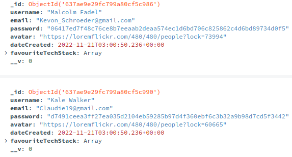

### Project Schema
```javascript
authorID: {
      type: Schema.Types.ObjectId,
      ref: "User",
      required: [true, "A project must have a author"],
},
/*Title of the project*/
title: {
    type: String,
    required: [true, "A Project must have a title"],
},
/*Each project has a post. The post will include this content*/
content: {
    type: String,
    required: [true, "A project must have content"],
    maxlength: 1000,
},
/*Number of likes; We'll populate this with from the "like" database*/
likeNumber: {
    type: Number,
    default: 0,
},
/*Number of comments; We'll populate this from the "comment" database*/
commentNumber: {
    type: Number,
    default: 0,
},
/*Like hashtags/keywords of a post/project*/
tags: [
    {
    type: String,
    },
]
```
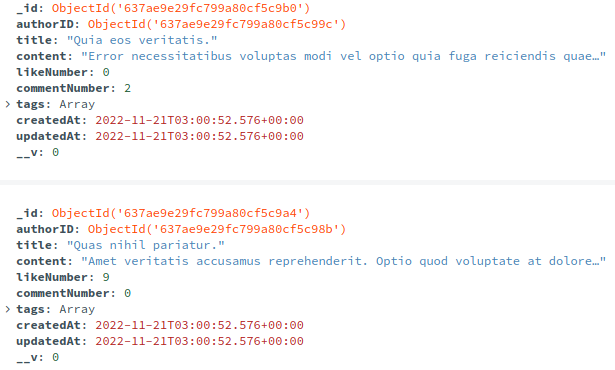

### Comment Schema
```javascript
_id: {
    type: Schema.Types.ObjectId,
    ref: "Comment"
}
/*Used to link a user's comment to a post*/
project: {
    type: Schema.Types.ObjectId,
    ref: "Project"
},
/*Used to link a comment from a post to a user*/
author: {
    type: Schema.Types.ObjectId,
    ref: "User"
},
/*Date posted*/
createdAt:{
    type: Date,
    default: Date.now()
},
/*Comment message*/
content:{
    type: String
}
```
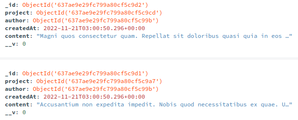

### Like Schema
```javascript
/*Used to link a user's like to a post/project*/
project: {
    type: Schema.Types.ObjectId,
    ref: "Project"
  },
/*Used to link a like from a post to a user*/
author: {
    type: Schema.Types.ObjectId,
    ref: "User"
}
```
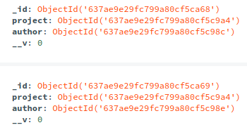

### Canvas Schema
```javascript
user:{
    type: mongoose.SchemaTypes.ObjectId,
    ref: "Use"
},
project:{
    type: mongoose.SchemaTypes.ObjectId,
    ref: "Project"
},
/*For stats*/
chatCommits:{
    type:Number,
    default: 0
},
/*Also for stats*/
upTime:{
    type: Date,
    default: Date.now(),
}
```
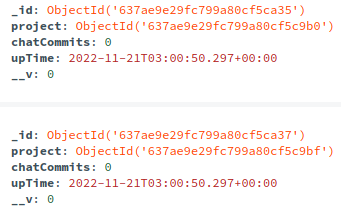


# URL Routes / Mappings
| URL Path          | Description      | Authentication |
| ------------- | ----------- | ----------- |
| `/` | Landing page | not required
| `/feed` | Feed page | not required but some features are restricted to only login users (see [below](#authorization))
| `/project?=...` | Each project has its own page | not required but some features are restricted to only login users
| `/canvas?=...` | Each project has its own canvas page | not required but some features are restricted to only login users
| `/profile?=...` | Other users profile | required
| `/dashboard` | Users own profile | required


# Authentication
Passwords are encrypted using SHA256 (1-way encryption). During login we encrypt the string and compare it with the password stored in the database (this password is already encrypted). You can see this in ```modal.js```:

```javascript
const hashPassword = await sha256(password, 12)
const correctPass = hashPassword === user[0].password;
```

## Authorization
- You can only use some features if you are already login (authenticated)

In the following example, you only have the option to "create post" once you're logged in:
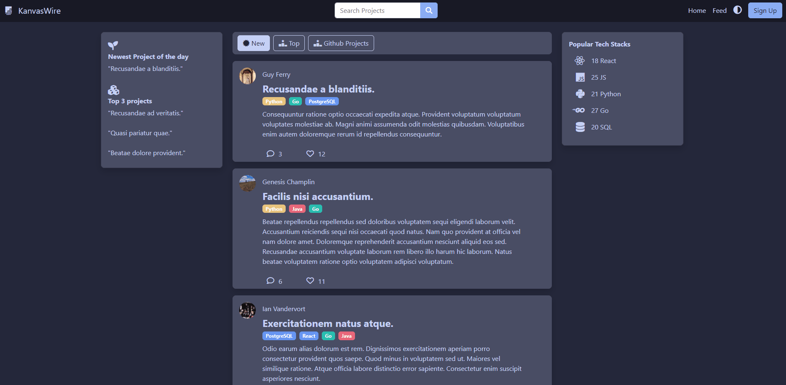

Some features that require authentication first:
- Create post (in feed page)
- Liking a post (in feed page)
- Wont be redirected to a project page (in feed page) but can still access a project if given a URL
- No button to redirect to Kanvas page (in feed page) but can still access a project if given a URL
- Visit other users profile (in profile page)
- Visit your own profile (in account page)
- See chat and interact in chat (in canvas page)
- Manage projects (in account page)

Refer to [this section](#url-routes--mappings) for more information on which page requires authentication

## Existing accounts
For testing purposes we provide the following list of account and password for testing:
```
Username || Pasword

Micaela.Cole14@hotmail.com || n7wjfolfvmxeujl
Eudora.Huels@hotmail.com || gsq3578gyxusqw6
Rossie.Mosciski99@gmail.com || ylnq5uicn10pggr
Jacques.Dickinson67@gmail.com || s72dp7nusdlogo2
Marcelino.Hand71@hotmail.com || dqd5dblbh80znrx
Prudence19@yahoo.com || x767t8s28uirbg7
Maegan_Murray@gmail.com || mpv8vekko5i2573
Cheyanne_Grady18@yahoo.com || 20220qjadpl72sp
Lavon.Goldner@yahoo.com || n5xg3sm9fdwtig1
Cedrick.Halvorson@yahoo.com || p1ywj76nhbvpr4c
```

# Division of Labor


# Conclusion