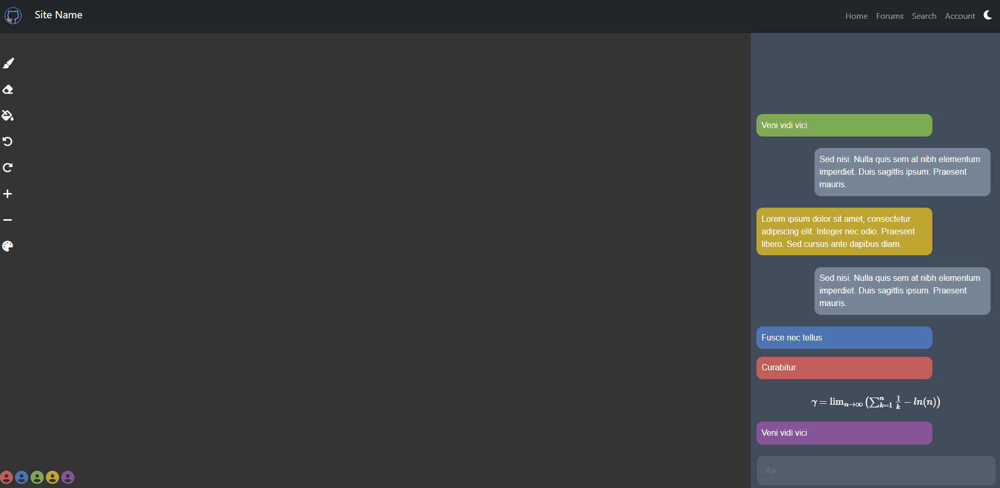
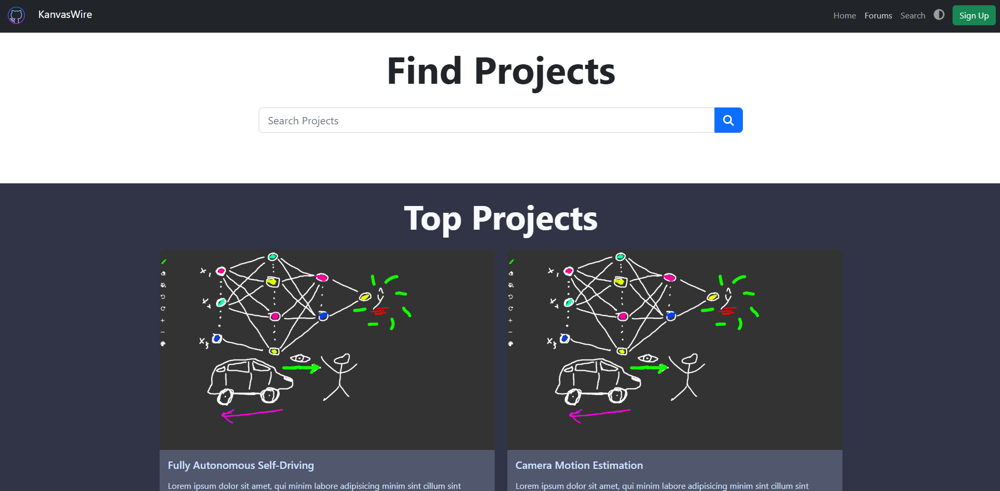
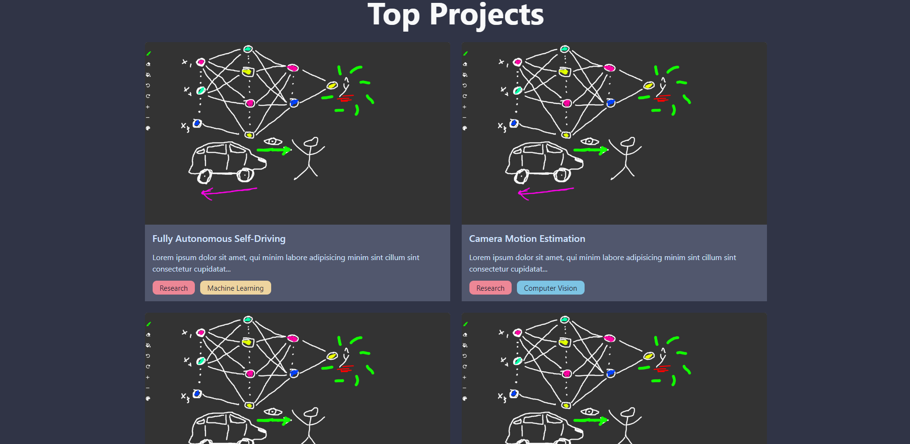
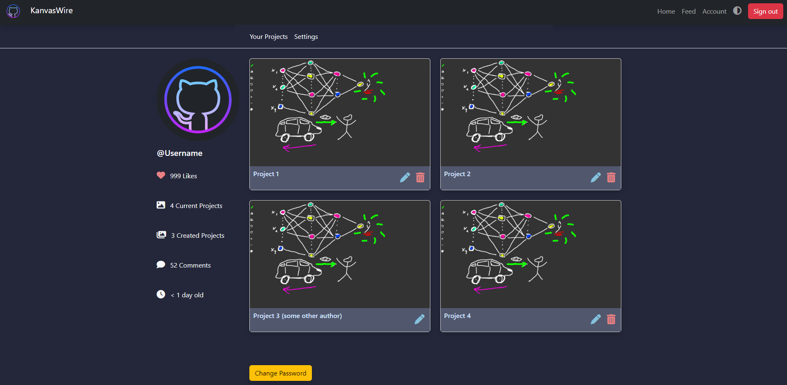
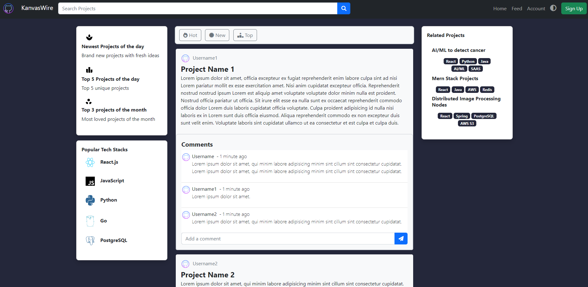
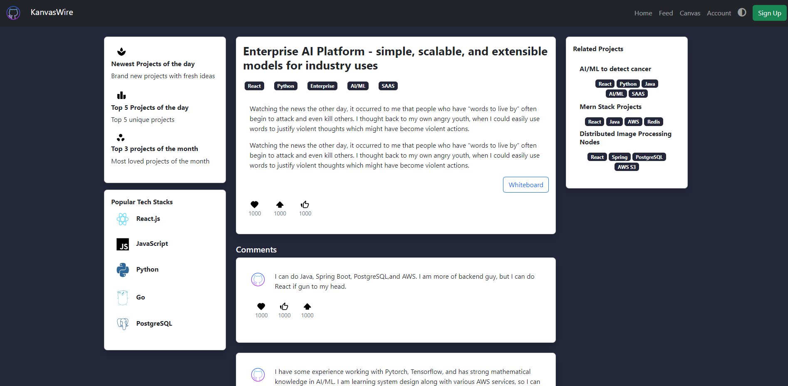
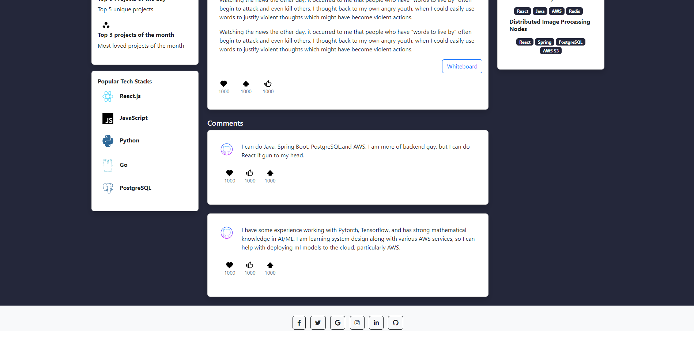
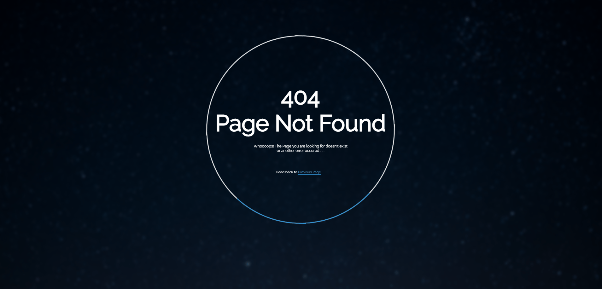

# Team Alef ( $\aleph$ )

# Application name
Kanvaswire

## Team Overview
- Hieu Nguyen ([HieuHongHao](https://github.com/HieuHongHao))
- Peter Phan ([PPhan-sil](https://github.com/PPhan-sil/))
- Phat Nguyen ([PeterNg15](https://github.com/PeterNg15))

# Part 0: Data Interactions
- Project posts, upvotes, comments, messages, stars, tags (programming tags, key word tages)
- Github repo lists
- Chat/comment messages
- Room session drwaings

# Part 1: Wireframes

# Part 2: HTML and CSS
Our website is hosted ([here](https://pphan-sil.github.io/326Project/)): https://pphan-sil.github.io/326Project/

### Canvas Page
Here is the design of our canvas page. Users will have the option to chat in this page (on the right side of the screen) as well as collaboratively draw on the canvas (on the left side of the screen). Up to 5 people could be in the same canvas room at the same time. Chatting is very straight-forward, you only need to type in the input and press enter to send a message. We will also make it possible to send math equations as well so that we reach our targeted audience (STEM projects). Some drawing tools (as can be seen on the left) will be helpful for the users in order to customize and personalize their experiences. The drawing tools includes a marker, an eraser, a paint bucket, a cntrl+z option, a way to change font size, and a color bucket to choose their paint color. Finally, at the bottom we will be able to see who is simultaneously in the canvas page (like google docs)! We have made our UI extremely intuitve while not sacrificing its functionality. 

### Landing Page
This is our landing page. When user is not logged in, they will visit the landing page before entering our app. The landing page features top projects of the day and has a search bar that allow user to quickly search for a project.

### Account Page
The account page is where user can configure, edit, and view personal informations and their past projects.

### Feed Page
If a user is logged in, they will be taken to the Feed Page instead of the landing page. Feed page has different projects ideas from users looking for collaborators and curated list of repo from Github for users who do not have an idea for the moment. The top left side bar features quick link to the newest projects of the day, and the top 5 and top 3 projects of the day and month. On the bottom left sidebar, we will show the most popuplar tech stacks used for projects in our platform, so user can choose to learn that tech stacks if they want to. A project post will have its name in the title, and users can comment under the post by texting in the text book and click the arrow button. On the right side bar, we have the Related Projects for users who looking projects similar to the one they are viewing. This page also has a search bar, where user can search a list of projects by tags, names, number of stars, likes, and upvotes.

### Project Page
The Project Page can be accessed by clicking in a project post in the Feed Page. This page will show more in-depth details about a single project, with tags and comments. The post also a link to the whiteboard, where users can access our canvas. Users can upvotes, hearts, or likes a project in here. This page also has the same side bars as the feed page, since we want to provide fast access for user to the top projects or the related projects without having to return to the Feed Page

### 404 Page Not Found
This is our 404 Page. This page should appear whenever a user tries to access an incorrect page or a page they are not authorized to

