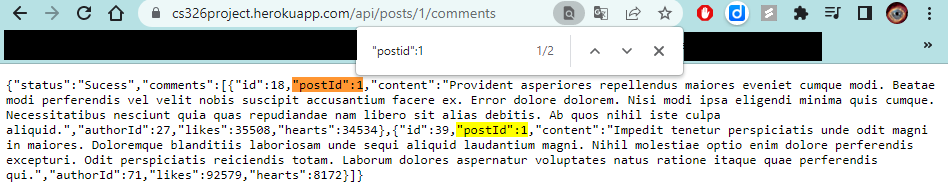

# Part 0: Project API Planning
## Data Model
 -  api/posts: returning all the posts 
    query: 
        tag: return all the posts with matching tags
        titles: return all the posts with matching titles
 -  api/posts/:id: return the data of post with matching id
 -  api/users: return all users information
 
## Github API Integration
We will be using the Github API to get the current top 5 repositories in the world. We will use this data and then display it to our feed page.


## Our APIs

### Database Diagram:
 
 

### User Object:
- Fields: userId, email, name, avatar, posts, totalPosts, likes, comments, dateCreated, favouriteTech, password
- API integration: Yes. We will set up a database with authentication. Login functionality currently uses this API.

| Fields        | Data Type   |
| ------------- | ----------- |
| userId        | int         |
| email         | string      |
| avatar        | string      |
| totalPosts    | int         |
| likes         | int         |
| comments      | int         |
| dateCreated   | datetime    |
| favouriteTech | string      |
| password      | string      |

View user: https://cs326project.herokuapp.com/api/users


Read user: https://cs326project.herokuapp.com/api/users/1 


### Post Object fields:
- Fields: Id, authorId, tags, title, content, likes, commentsId
- API integration: Yes. Create can be done on feed and dashboard. Read occurs on feed, forum, and dashboard. Update (for likes) occurs on feed and forum. Delete occurs on dashboard.

| Fields        | Data Type   |
| ------------- | ----------- |
| postId        | int         |
| authorId      | int         |
| tags          | [string]    |
| title         | string      |
| content       | string      |
| likes         | [int]       |
| commentsId    | [int]       |

View user: https://cs326project.herokuapp.com/api/posts


Search a user: https://cs326project.herokuapp.com/api/posts/1 


### Comment Object fields:
- Field: commentId, authorId, postId, content, likes
- API integration: Yes. Create, read, update (likes) occurs on forum page (maybe add deletion later).

| Fields        | Data Type   |
| ------------- | ----------- |
| commentId     | int         |
| authorId      | int         |
| postId        | int         |
| content       | string      |
| likes         | [int]       |

Search a comment: https://cs326project.herokuapp.com/api/posts/0/Comment
Note that a comment must be related to a post



### Canvas Object fields:
- Field: canvasId, postId, ownerId, drawing, users
- API integration: We want to store art strokes (stored as an array) and this is hard to store in a JSON file when multiple users need to write on it simultaneously and in real-time; So we saved this for when we use MongoDB.

| Fields        | Data Type   |
| ------------- | ----------- |
| canvasId      | int         |
| postId        | int         |
| ownerId       | int         |
| drawing       | [strokes]   |
| users         | [int]       |

View canvases: https://cs326project.herokuapp.com/api/canvas


Search a canvas: https://cs326project.herokuapp.com/api/canvas/1 


# Part 1: Back-end Skeleton Code
## Application Structure

```
root/
├─ css/
├─ backend/
│  ├─ database.js
├─ pages/
│  ├─ feed.html
│  ├─ forum.html
│  ├─ canvas.html
│  ├─ dashboard.html
│  ├─ dashboard.html
├─ scripts/
│  ├─ main.js
│  ├─ modals.js
│  ├─ utils.js
├─ package.json
├─ server.js
├─ index.html
```

### Server and index
The deployment of the app is handled on `server.js`. `server.js` sets up the API to be used and serves `index.html` which displays the contents of the website. `socket.io` is also set up in `server.js` for the chat functionality on the canvas page. Every pages of the website is loaded in and out of `index.html` depending on the URL route.

### Routing
Routing is handled through `router.js`. `router.js` loads the main contents of a page according to the URL then loads the corresponding javascript that runs that particular webpage. Other miscellaneous initializations a page requires is also handled in `router.js`.


# Part 2: Frontend implementation
## All pages:
- Can logout and login using modal and JS on all pages when applicable. This uses the *User* table to authenticate login

## Feed page:
- On this page, you can create posts, search for posts, search top Github repos, and like a post. This uses the CRUD of the Posts API as well as GitHub's API

### Create and Read Posts


### Search a Post by tags and titles


### Update a Post (by adding/removing a user ID to like array in *Posts* table)


### Github API to display top repos


## Forum page:
- Can like post with like button
     - Purposely makes the like button disappear to incentivize people from unliking a post so that each post they like are serious


## Dashboard page:
- Can edit posts (change post names), delete posts, update user password, delete account using *Posts* and *User* table
- View user information using *User* table

### User's posts gets loaded from API (reads *Posts* table)


### User's dashboard after deleting some posts (deletes *Posts* table)


### User's update password (updates *User* table)


### User deletes account (deletes from *User* table)


## Canvas:
- With our canvas page we used the *User* table to do several things including:
    - Check whether user is in a canvas
    - Get users PFP and name to display in chat
- We used socket.io to let users from different accounts type to each other; Here is a video demo of our work:
    - The video below demos 2 users (logged in on 2 different browsers) chatting with each other.
### Chat Demo


### Canvas Drawing Pad Demo


## Misc:
We also implemented a feature to toggle light and dark mode:

