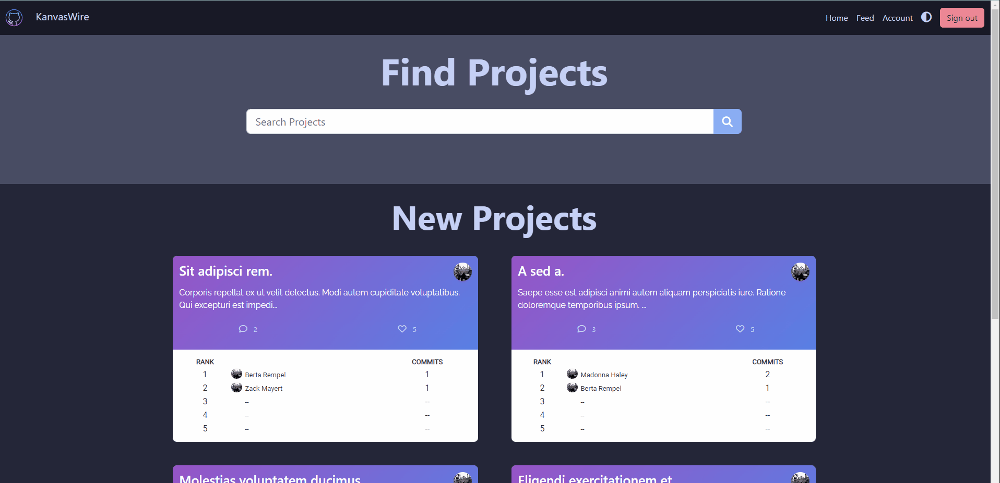
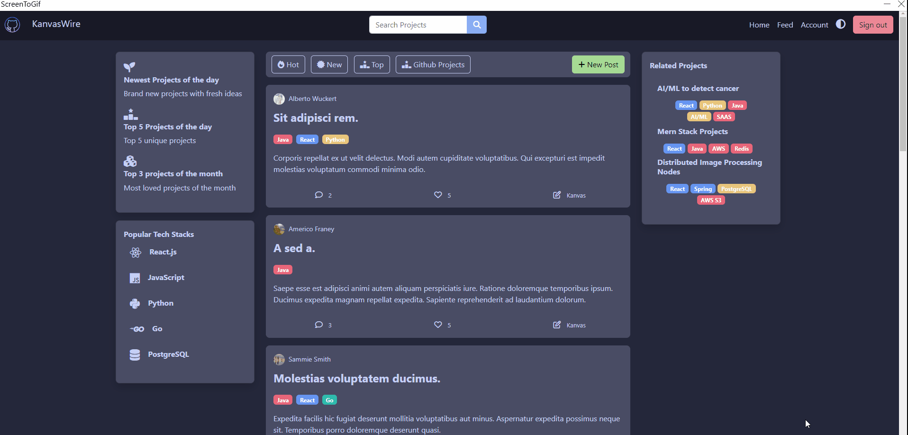
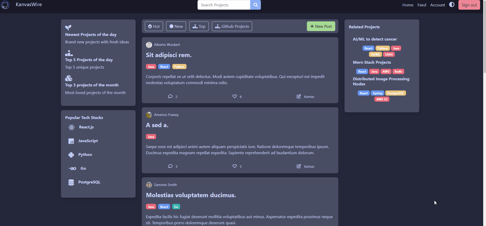
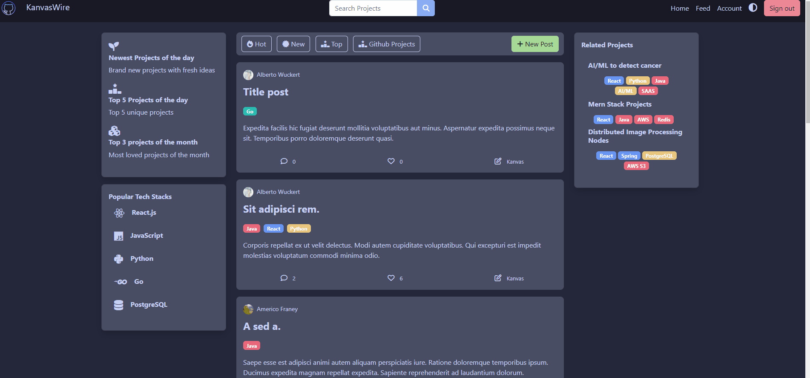
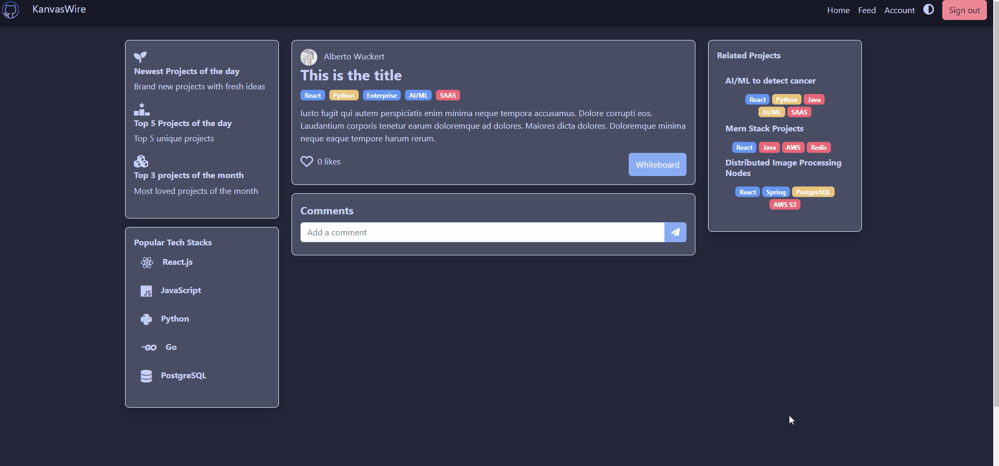

# Our Webpage

URL: https://cs326project.herokuapp.com/

# Part 0 Setup
You can see how to setup and use our website through ```setup.md```

# Part 1 Database Implementation

## Database
For the database we are using MongoDB. 
### User Schema
```
/*User's name*/
username: {
    type: String,
    required: [true, "User must have a username"]
},
/*Users email they use to login*/
email: {
    type: String,
    required: [true, "User must have an email"]
},
/*Encrypted password using SHA256*/
password: {
    type: String,
    require: [true, "User must have a password"],
    minlength: 6,
},
/*URL to their avatar*/
avatar: {
    type: String,
    default: "https://loremflickr.com/cache/resized/65535_52235423932_e5012af91a_b_480_480_nofilter.jpg",
},
/*Datetime the user created the account*/
dateCreated: {
    type: Date,
    default: Date.now(),
},
/*Fun facts and stats we'll use to display in the future*/
favouriteTechStack: [{ type: String }]
```

### Project Schema
```
authorID: {
      type: Schema.Types.ObjectId,
      ref: "User",
      required: [true, "A project must have a author"],
},
/*Title of the project*/
title: {
    type: String,
    required: [true, "A Project must have a title"],
},
/*Each project has a post. The post will include this content*/
content: {
    type: String,
    required: [true, "A project must have content"],
    maxlength: 1000,
},
/*Number of likes; We'll populate this with from the "like" database*/
likeNumber: {
    type: Number,
    default: 0,
},
/*Number of comments; We'll populate this from the "comment" database*/
commentNumber: {
    type: Number,
    default: 0,
},
/*Like hashtags/keywords of a post/project*/
tags: [
    {
    type: String,
    },
]
```

### Comment Schema
```
_id: {
    type: Schema.Types.ObjectId,
    ref: "Comment"
}
/*Used to link a user's comment to a post*/
project: {
    type: Schema.Types.ObjectId,
    ref: "Project"
},
/*Used to link a comment from a post to a user*/
author: {
    type: Schema.Types.ObjectId,
    ref: "User"
},
/*Date posted*/
createdAt:{
    type: Date,
    default: Date.now()
},
/*Comment message*/
content:{
    type: String
}
```

### Like Schema
```
/*Used to link a user's like to a post/project*/
project: {
    type: Schema.Types.ObjectId,
    ref: "Project"
  },
/*Used to link a like from a post to a user*/
author: {
    type: Schema.Types.ObjectId,
    ref: "User"
}
```

### Canvas Schema
```
user:{
    type: mongoose.SchemaTypes.ObjectId,
    ref: "Use"
},
project:{
    type: mongoose.SchemaTypes.ObjectId,
    ref: "Project"
},
/*For stats*/
chatCommits:{
    type:Number,
    default: 0
},
/*Also for stats*/
upTime:{
    type: Date,
    default: Date.now(),
}
```

## Secrets
Secrets are stored in Heroku. We access them with the ```process.env.DATABASE_URL``` for the URL of the database, and ```process.env.PORT``` for the port. To test locally, we need to set up a ```.env``` file with these values. However, we do not push these secrets to the repo.

# Part 2 Back-end Functionality

## 2.1 Back-end

### Landing page
1. Get projects from Project DB
2. Generate leaderboard based on stats from Canvas DB
3. Display number of likes and comments for each post



## Feed
1. Persistence likes; Likes and unlike; Updates like number
2. Get projects from Project DB
3. Display number of likes and comments for each post
4. Display avatar of post owner
5. Selective searching of projects based on tags

### Likes (in Feed)



### Search (in Feed )



### Create Post (in Feed)


## Project

### Add comments


## 2.2 Password Encryption

Passwords are encrypted using SHA256 (1-way encryption). During login we encrypt the string and compare it with the password stored in the database (this password is already encrypted). You can see this in ```modal.js```:

```
const hashPassword = await sha256(password, 12)
const correctPass = hashPassword === user[0].password;
```


# Part 3 Deployment

URL: https://cs326project.herokuapp.com/

# Part 4 Division of Labor
Peter Phan: 

Phat Nguyen (Peter): 

Hieu Nguyen: 
